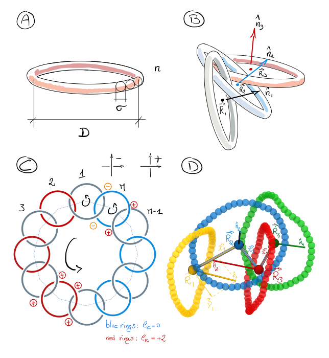
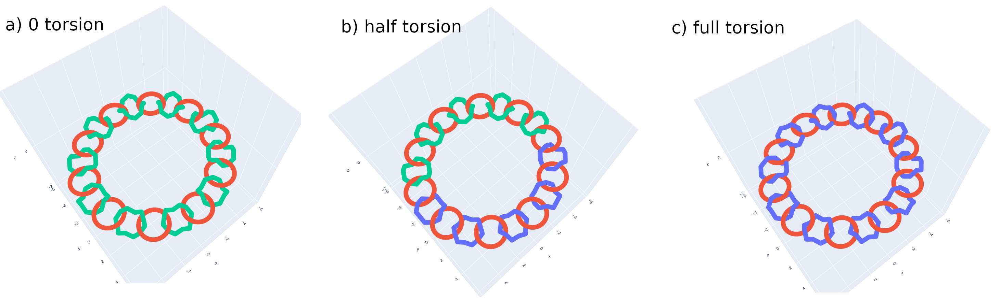

Rings of rings
============================
This software can be used to simulate circular poly-[n]catenanes made of semi-rigid rings and characterize their physical behaviour.

Our poly-[n]catenanes are composed by $`n`$ semirigid bead-and-spring rings, each with $`m`$ beads and persistence
length $`l_p = 2m`$ (see panel a of the figure below). In each ring, connectivity is enforced through a FENE potential. Rings interact only through 
a WCA potential, i.e. steric hindrance. Simulations can be performed with a Langevin dynamics.

Depending on the way the catenanes are closed, they can store twist which is topologically quenched. 
We insert twist by controlling the number of rings which form 2 +1 Hopf-links with their neighbours,
in red in the figure below. This number is indicated by $`n_{tw}`$ and can go from 0 to $`n/2`$. We call the relative 
twist $`l_k = 2 n_{tw}/ n`$.

Given the high bending rigidity of the rings, they can be coarse-grained by mapping each of them to their
center of mass (CoM) and normal vector, as shown in panels B and D below. 
We use this strategy to define the *Twist* and *Writhe* of the catenanes, as well as other quantities. 


The parameters $n$, $m$, $n_{tw}$, completely control the physical behaviour of the systems, as the rings interact only through excluded volume. The effect can be already seen from the figure below, which depicts some random conformations
for different systems.


## Requirements
* Python > 3.8
* Conda Python. 
* The required packages are included in the file `conda_QCB_essentials.yml`. This can be used to create a conda environment, 
by running the following command:
```
conda env create --file ror.yml
```

## Steps to reproduce
#### A. Set up  the Python environment
1. Install [anaconda python3](https://www.anaconda.com)
2. Create the conda environment with the needed package by running 
`conda env create --file ror.yml` from the base directory
3. Activate the environment: `conda activate ror`

#### B. Create the starting files
After activating the `ror` environment, run `jupyter notebook` and
open the notebook `notebooks/1.0-system-builder.ipynb`. Modify the parameters if needed and run it.
The notebook will populate the folder `/data/01-lammps-init`.

### C. Run lammps simulations
Keeping the same directory structures and names, run the simulations with lammps. 
For this is sufficient to copy the directories created at step B on a production machine and run lammps 
using the files inside each.

### D. Analyze the results
After step C, copy back the directories in folder `data/02-raw` without changing names.
Activat again the `ror` conda environment (step A.2) and run the script 
`/src/analysis/analyze_trajectories_twisted_bb.py`. 

The script will produce the corresponding directories in folder `\data/03-analyzed`. 
Each folder will contain three files: a `.vtf` with the coarse-grained structure (can be read by VMD),
a file `_local_properties.vtf` and a file `_global_properties.vtf` storing local
(twist, normal-normal correlations) and global (Rg, writhe, total twist) properties 
The .csv files can be opened with pandas. Check the notebook `02-reading-results.ipynb`.
of the analyzed catenanes. 


## Important notes
In the code, for the moment, the parameters used in the paper are mapped as follows:
- $n$ -> `M`
- $m$ -> `n`
- $n_{tw}$ -> `M_a` 

## Organization
The repository is organized as follows.
```
.
├── bin                # -> general usage script (set up directories, etc).
├── data
│   ├── 01-lammps-init # -> lammps input files 
│   ├── 02-raw         # -> lammps trajectories
│   ├── 03-processed   # -> coarse grained data and analysis divided per system 
│   └── 04-analyzed    # -> Analyses (aggregated data)
├── notebooks          # -> Jupyter notebooks (system built)
├── src                # -> Software
│    ├── analysis      # -> Analysis scripts/codes
│    └── ror           # ring-o-rings Python package
│        └── templates # Jinja templates
└── visualization      # -> figures
```

## Simulation and Analysis pipeline
Each system in our pipeline is identified by the string `M<M>n<n>Lk<lk>` or `M<M>n<n>Ma<M_a>`, where the values `<M>`,`<n>`, `<lk>`, `<M_a>`
are substituted with the numerical values identifying a system.

####  1. Initial conformations (`data/01-lammps-init`)
All Initial configurations, including lammps input scripts, are stored in the tar.bz2 archive in `data/01-lammps-init`.
Once unpacked,  each system correspond to a different
subdirectory. For example, the starting configurations for $M`=20`$, $`n=48`$, $`M_a=0`$ is stored in `data/01-lammps-init/cat_M20n48Lk0.0/`.

As depicted below, the initial conformations include distorted rings which are smoothed by an initial minimization procedure.


#### 2. Lammps trajectories
The resulting trajectories and restart file for each system are stored in the corresponding subdirectory of `data/02-raw`. Further subdirectories are
used to distinguish some DNA systems we simulated. 

#### 3. Coarse-Graining and per-simulation analysis
Given the high bending rigidity of the rings, they can be coarse-grained by mapping each of them to their
center of mass (CoM) and normal vector. We use this strategy to define the *Twist* and *Writhe* of the catenanes, as well as other quantities. 

#### 4. Analyzed data
This directory stores the aggregated data obtained from different systems. This data was used to produce the figures in our draft.

### Example results
The folders `data/01-lammps-init`, `data/02-raw` and `data/03-processed` include a `.tar.bz2` archive each. 
These archive, once unpacked populate the respective directories with 
1. the init files generated by `notebooks/1.0-system-builder.ipynb`,
2. For example trajectories, which can be processed using `src/analysis/analyze_trajectories_twisted_bb.py`
3. The processed files produced by 2., which can be read and further analyzed using the notebook `2.0-analyze-trajectories.ipynb`. 

## Analysis package
The whole analysis package is written in python and stored in the `src/ror` directory. It is organized as follows.
```
ror
├── IO.py                                # I/O functions
├── abstract_CG.py                       # Coarse-graining class (abstract class)
├── com_CG.py                            # Coarse-graining using Center of Mass (COM)
├── analysis_pipeline.py                 # Class implementing all analysis steps for a given system
├── backbone_analyses.py                 # module defining all analyses for a catenane
├── builder.py                           # System building (catenane)
├── dodecagons.py                        # System building (rings)
├── ribbon.py                            # Twist, Writhe, Rg, etc for a ribbon. Used by backbone_analyses
└── templates                            # -> Jinja templates for system building, used by builder.py
    ├── pbs_template.pbs
    ├── slurm_template.slrm
    ├── template_dodec2rings.lmp
    ├── template_lmp_input.dat
    ├── template_rigid.lmp
    ├── template_rings.lmp
    └── template_rings_restart.lmp
```
